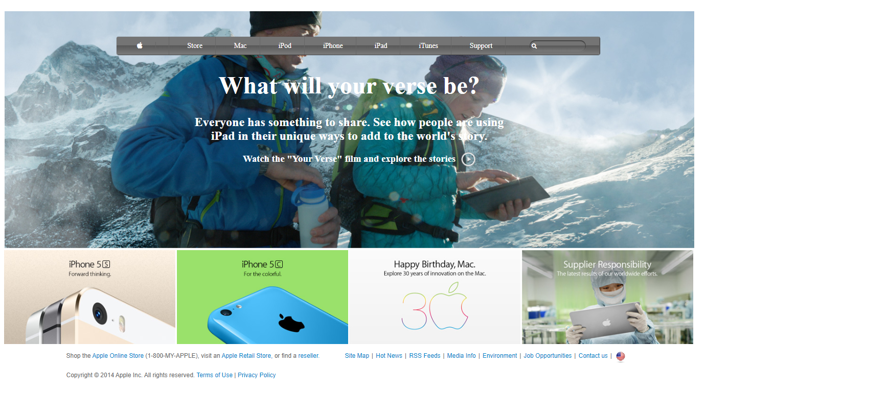

# Apple-page-clone

displaying the use of gradients and background-images

This project was conceived so as to test the level of understanding of the programmer on gradients and background-images and how to manipulate them properly.

# Built With

-   HTML
-   CSS
-   Font Awesome

## Live Demo

[Live Demo Link](https://github.com/emmanuellekamwa/Apple-pee/feature-pageage-clone/tr)

## Author

**Emmanuelle Kamwa**

-   Github: [@emmanuellekamwa](https://github.com/emmanuellekamwa)
-   Twitter: [@AlixKamwa](https://twitter.com/AlixKamwa)
-   Linkedin: [emmanuelle-kamwa-86145a1a4](https://www.linkedin.com/in/emmanuelle-kamwa-86145a1a4/)

# Show Some Support

Give a ⭐ if you've liked my project and your comments are highly accepted.
